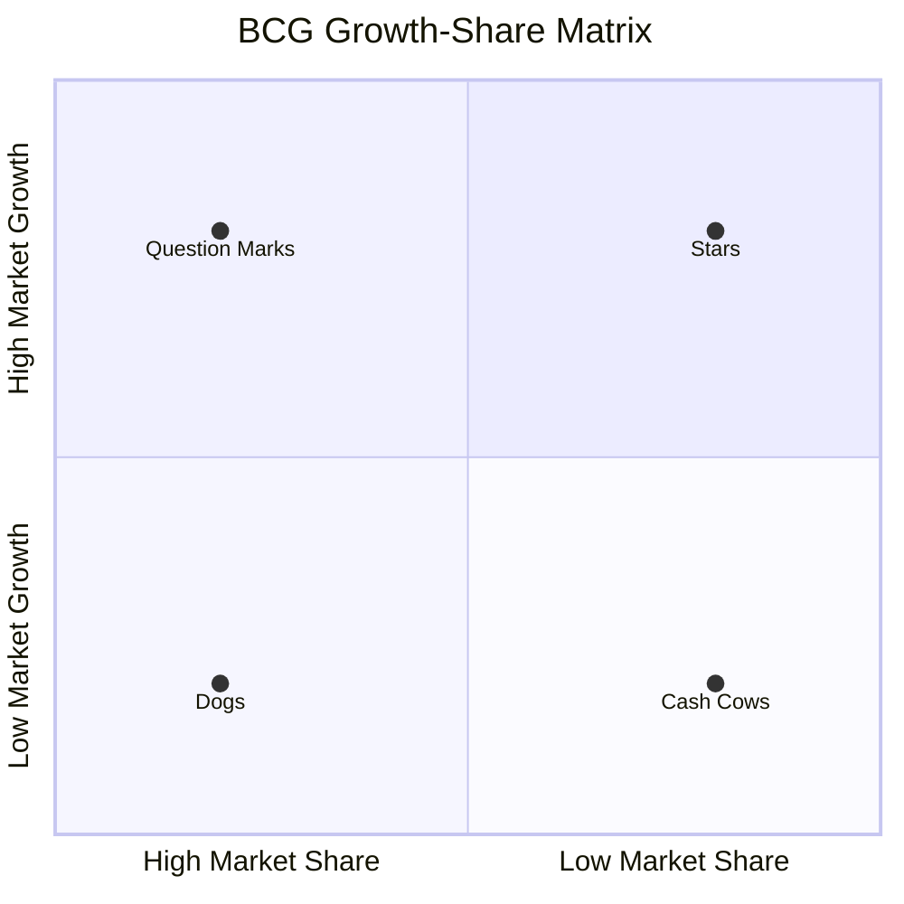
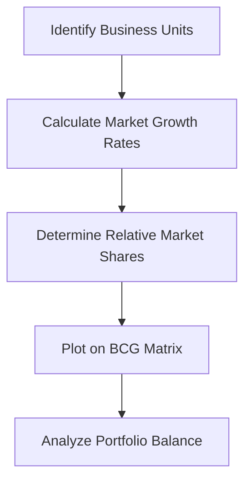

# BCG Growth-Share Matrix: Strategic Portfolio Analysis

## Overview
The **BCG Matrix** (Boston Consulting Group Growth-Share Matrix) is a portfolio management framework developed by Bruce Henderson in 1970. It helps corporations allocate resources among their business units based on market growth rate and relative market share.

## Core Framework

## The Four Quadrants Explained
### 1. 🐄 Cash Cows

Characteristics:

 - High market share in low-growth markets
 - Generate significant cash flow
 - Low maintenance costs
 - Market leaders in mature industries

Strategic Implications:

 - Milk for cash to fund other business units
 - Maintain market position with minimal investment
 - Defend against competitors
 - Focus on operational efficiency
 - Examples: Microsoft Windows, Coca-Cola Classic, Intel's CPU business

### 2. ⭐ Stars

Characteristics:

 - High market share in high-growth markets
 - Require significant investment to maintain position
 - Potential future cash cows
 - Competitive markets with high innovation
   
Strategic Implications:

 - Invest heavily to maintain/grow market share
 - Build competitive barriers
 - Focus on product development and marketing
 - Monitor closely as they transition to cash cows

Examples: Tesla EV division, Amazon Web Services, Apple iPhone

### 3. ❓ Question Marks (Problem Children)

Characteristics:

 - Low market share in high-growth markets
 - High uncertainty and risk
 - Require substantial investmen
 - Potential to become stars or dogs

Strategic Implications:

 - Selective investment based on potential
 - Conduct thorough market analysis
 - Set clear performance milestones
 - Consider divestment if no growth potential

Examples: Startups in emerging markets, new product lines, geographic expansions

### 4. 🐕 Dogs

Characteristics:

 - Low market share in low-growth market
 - Generate little to no profit
 - May consume management time disproportionately
 - Limited growth prospects

Strategic Implications:

 - Divest or harvest
 - Minimize investment
 - Consider niche strategies if sustainable
 - Free up resources for more promising units

Examples: Legacy products, declining business lines, outdated technologies

## Implementation Framework

### Data Requirements

 - Market Growth Rate: Industry CAGR, typically using 10% as threshold
 - Relative Market Share: Your market share ÷ Largest competitor's market share
 - Revenue/Sales Data: Current and historical performance
 - Cash Flow Analysis: Investment requirements and returns

Strategic Portfolio Balance
Quadrant	Ideal Portfolio %	Investment Strategy	Management Focus
Stars	20-30%	Heavy investment	Growth & market leadership
Cash Cows	40-50%	Minimal investment	Cash generation & efficiency
Question Marks	10-20%	Selective investment	Analysis & rapid testing
Dogs	0-10%	Divestment	Cost reduction or exit

## Limitations and Criticisms

##⚠️ Key Limitations

 1. Oversimplification: Reduces complex businesses to two dimensions
 2. Market Definition: Ambiguity in defining "market" and "market share"
 3. Ignoring Synergies: Doesn't account for interdependencies between units
 4. Static Analysis: Doesn't capture market dynamics and evolution
 5. Cash Flow Assumptions: Not all cash cows generate cash equally

## Modern Adaptations

 - Time Dimension: Adding trend analysis for movement between quadrants
 - Profitability Metrics: Incorporating ROI and profit margins
 - Strategic Importance: Considering non-financial strategic value
 - Digital Metrics: Including user growth, engagement, and network effects

## Practical Application Steps
## Step 1: Data Collection

## Step 2: Strategic Analysis

1. Plot each business unit on the matrix
2. Calculate circle sizes proportional to revenue
3. Analyze current portfolio balance
4. Identify strategic gaps and opportunities

## Step 3: Action Planning

 - Develop quadrant-specific strategies
 - Allocate resources accordingly
 - Set performance metrics and timelines
 - Establish review cycles

Case Study: Procter & Gamble
Product Line	BCG Classification	Strategy
Tide Detergent	Cash Cow	Maintain dominance, incremental innovation
Gillette Razors	Cash Cow	Defend market share, premium pricing
SK-II Skincare	Star	Aggressive global expansion, marketing
New Digital Brands	Question Marks	Test markets, limited rollout

## Best Practices
✅ Do's

 - Use as a starting point for strategic discussion
 - Combine with other analytical tools (SWOT, Porter's Five Forces)
 - Update regularly (quarterly/annually)
 - Consider both quantitative and qualitative factors
 - Involve cross-functional teams in analysis

❌ Don'ts

 - Don't make decisions based solely on the matrix
 - Don't ignore emerging trends and disruptions
 - Don't apply to very small or very large business definitions
 - Don't forget about international and digital competition

## Conclusion

The BCG Matrix remains a valuable tool for:

 - Visualizing business portfolio composition
 - Prioritizing resource allocation
 - Identifying strategic imbalances
 - Communicating corporate strategy

However, it should be used as part of a comprehensive strategic analysis toolkit rather than as a standalone decision-making mechanism.

Based on research from: Boston Consulting Group, Harvard Business Review, and strategic management literature
